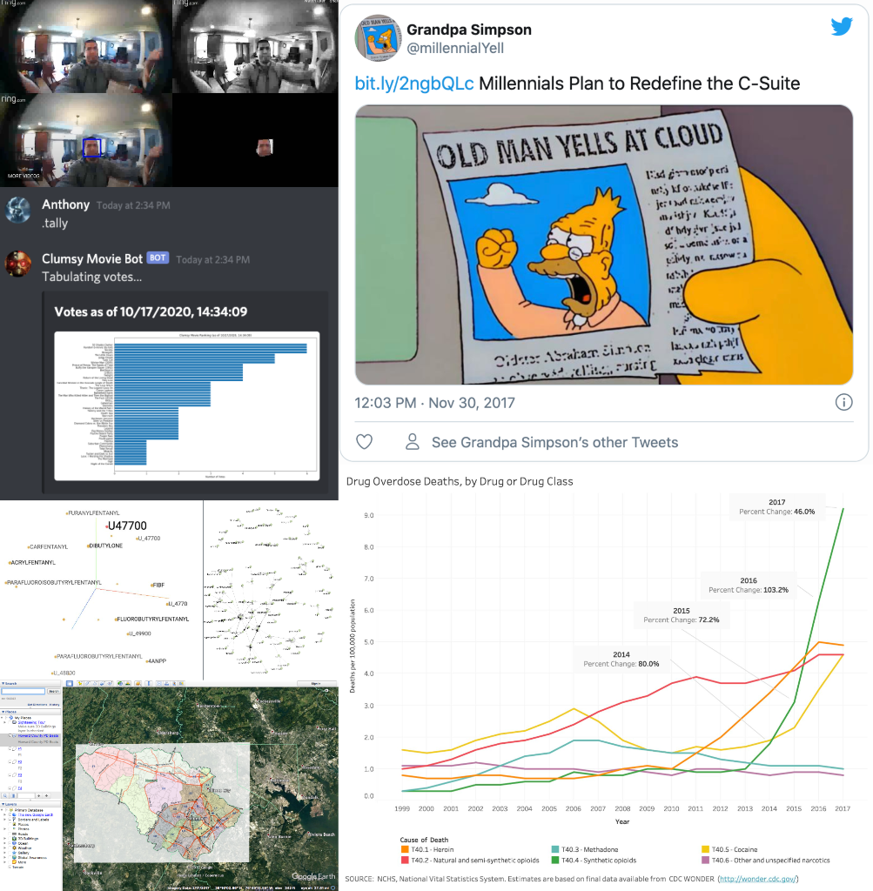

Health communications specialist with the CDC's National Center for Health Statistics, combining specializations in data science and database systems to provide meaningful and actionable data-driven insights and efficient IT systems.

# Summary of Experience
Over 11 years of experience applying concepts of computer science as a web developer with consistent record of superior ratings providing customer service and project management. Primary areas of expertise in front end web technologies, Section 508 compliance, and data visualization. Proven ability to direct small project teams in order to develop cost effective technical solutions in short turnaround time. Strong analytic and research skills necessary to the design and development of data systems. 

# Skills
* Programming Languages: Python, R, SAS
* Data Visualization: D3, Tableau, Power BI, SAS Visual Analytics
* Web Content Management Systems: Percussion, WordPress, SharePoint and Nintex Workflows
* Web Technologies: HTML, CSS, JavaScript, JQuery, XML, PHP
* Database Systems: Oracle 11g, SQLite
* Operating Systems: Windows, Mac, and UNIX	
* Software: Microsoft Office, Adobe Creative Suite (Dreamweaver, Flash, Acrobat, Photoshop, Illustrator, Audition, Captivate)
* Section 508 compliance testing tools: Adobe Acrobat, JAWS, ZoomText, CommonLook

# [Data Science Portfolio](https://alipphardt.github.io)

